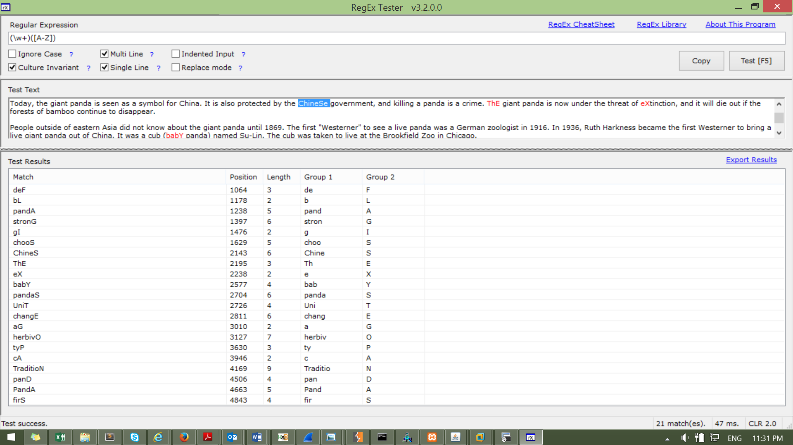

# Perfect Concealment - 100
Problem:
They gave a text file [stg100.txt](kapifiles/stg100.txt)

```
The giant panda (Ailuropoda melanoleuca, meaning "black and white cat-foot") is a type of bear. It lives in bamboo forests in central China. The giant panda is an endangered animal. In November 2007, China had 239 giant pandas who lived in captivity. There are 27 giant pandas which live in zoos outside of China. The exact number of giant pandas in the wild is not known. Some sources say there are about 1,590, other sources give a number between 2,000 and 3,000. The number of giant pandas in the wild seems to be increasing.

Giant pandas are about 1.2–1.5 m long and about 75 cm high. They weigh between 75 and 160 kg. Giant pandas have white fur on their bodies and black fur on their legs and shoulders. They also have black ears and black patches around their eyes. Pandas can climb and swim well.

Giant pandas are born with pink skin, with black areas on the legs, ears, and eyes. They are usually born with a small amount of white fur. They get more fur when they are about nine months old.

Giant pandas live alone. Females have a territory which they deFend against other females. When female pandas are ready to mate, they give off a special scent and make a loud bLeating noise to tell the males that they are ready. Giant pandAs mate between the months of March and May which is the Summer months in China. If there are several males, they fight each other. The one who wins – the stronGest male, then mates with the female. In August or September, the female gIves birth to one or two babies. If she has two babies, she will only raise one baby, and the other baby dies, no-one really knows how the female panda chooSe between the two. Giant panda babies are very small, and weigh only 90–130 grams, which is about 1/900 of its mother's weight. The baby drinks milk until it is 8–9 months old. Young pandas live with their mothers until they are 18–24 months old. They become mature when they are 5–7 years old. They live around 20 years in the wild and up to 30 years in captivity (e.g. in zoos). Unlike other bears, pandas do not hibernate.

Today, the giant panda is seen as a symbol for China. It is also protected by the ChineSe government, and killing a panda is a crime. ThE giant panda is now under the threat of eXtinction, and it will die out if the forests of bamboo continue to disappear.

People outside of eastern Asia did not know about the giant panda until 1869. The first "Westerner" to see a live panda was a German zoologist in 1916. In 1936, Ruth Harkness became the first Westerner to bring a live giant panda out of China. It was a cub (babY panda) named Su-Lin. The cub was taken to live at the Brookfield Zoo in Chicago.

In the 1970s, China began showing giant pandaS in zoos in the UniTed States and Japan as a type of diplomacy. This happened until 1984, when China changEd how this was done. Starting in 1984, China would allow zoos to keep the giant pandas for 10 years, but the zoo would have to pay China up to $1,000,000 each year. Also, the zoo would have to aGree that any cubs born would belong to China.

Although their bodies are made to eat meat, giant pandas are mostly herbivOrous. Their main source of food is bamboo. Because pandas have the digestive system of carnivores and can not digest cellulose very well, they get little energy and protein from the bamboo they eat. Because they get very little nutrition from bamboo, they must eat a lot. Pandas commonly eat 20 to 30 pounds of bamboo a day to get the nutrition they need. Although there are more than 200 different varieties of bamboo the Panda will only eat 20 varieties. Pandas sometimes run out of food, as a tyPe of bamboo flowers, die, and regrow again at the same time.

As of 2008, the giant bear is an endangered animal. The main problem they have is habitat loss. Habitat loss is when the places they live in are ruined. Humans often ruin the places where pandas live, such as for the construction of buildings. Pandas cAn also lose their habitat because of pollution. Pollution means that less bamboo grows, or that bamboo stops growing completely in a certain place. Giant pandas also have a low birth rate, which makes the problem worse.

TraditioNal Chinese stories about the giant pandas say that the animal can be very powerful. Some people believe that sleeping on a panda skin can protect them from ghost and predict their future. These tales are one of the reasons why people would spend lots of money for the skin and fur of this precious animal.

In former times, the panDas were also hunted. The Western people who came to China were soon unable to hunt the pandas, because of different wars. Local people continued though. PandAs were mainly hunted for their fur. Today, hunting pandas is not allowed.

In 1963, China set up a nature reserve for pandas, the Wolong National Nature Reserve. This was the firSt, other nature reserves followed. China did this to fight the number of pandas going down. In 2006, there were 40 panda reserves, compared to 13, two decades ago.
```

In the text you will notice there are some word that consists of suspicious various size of charactors
```
deFend
pandAs 
stronGest 
ChineSe 
.
.
.
```

Let try to extract all suspicous word with Regex Tester for windows and then got the flag.
```
Regex: (\w+)([A-Z])
```



The flag was:
* FLAGISSEXYSTEGOPANDAS
