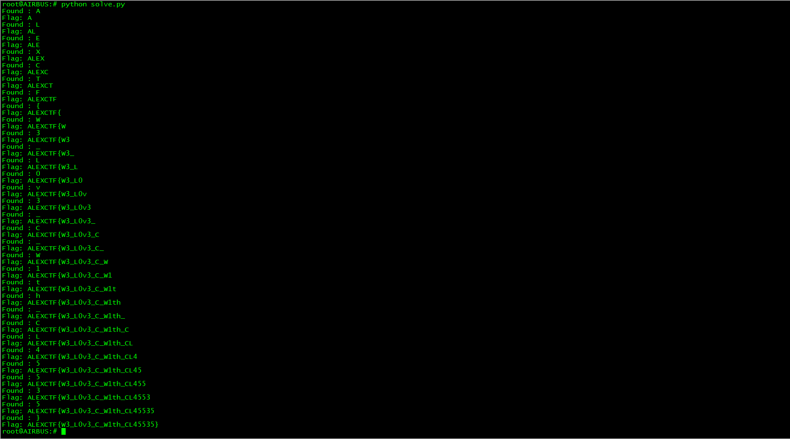
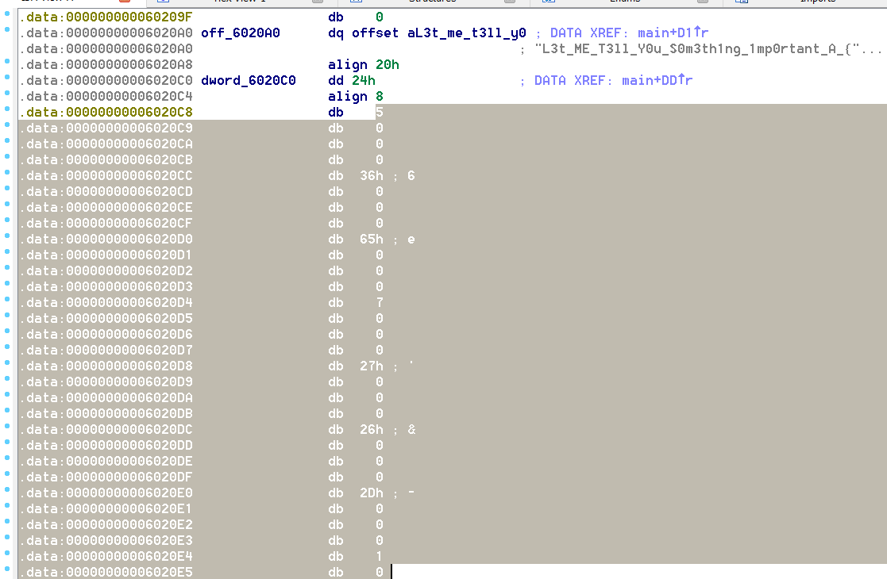
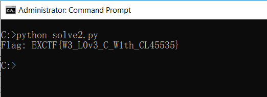

# __C++ is awesome - 100__
The challenge is here: [link](https://github.com/ctfs/write-ups-2017/tree/master/alexctf-2017/reverse-engineering/re2-cpp-is-awesome-100)

> They say C++ is complex, prove them wrong!

After using IDA to skim to the assembly code, we found some text: 


After checking the IDA graph view, I know that the application looping check for each input character by character


So write a python code to guess the flag by checking each characters:
```python
import sys, time
from subprocess import Popen, PIPE, STDOUT

def check(startString):
	foundSTR = ""
	for x in "abcdefghijklmnopqrstuvwxyzABCDEFGHIJKLMNOPQRSTUVWXYZ0123456789_-{}":
		findingSTR = startString + x
		process = Popen(["./re2", findingSTR], stdout=PIPE, stdin=PIPE, stderr=PIPE)
		(output, err) = process.communicate(input="")
		if not "Better luck" in output:
			foundSTR = x
			print "Found : " + str(x)
			break
	return foundSTR

flag = ""
while True:
	flag = flag + check(flag)
	print "Flag: " + flag
	if flag[-1] == "}":
		break
```



#### __Flag:__

> ALEXCTF{W3_L0v3_C_W1th_CL45535}


### __Another Approach__

After reviewing the IDA, I found that the binary contains 2 arrays. One is string array and the other is number which could be indexes point to string array.




Now I write python code to solve to problem.
```

init_string = "L3t_ME_T3ll_Y0u_S0m3th1ng_1mp0rtant_A_{FL4G}_W0nt_b3_3X4ctly_th4t_345y_t0_c4ptur3_H0wev3r_1T_w1ll_b3_C00l_1F_Y0u_g0t_1t"

flag = ""

for x in [5, 54, 101, 7, 39, 38, 45, 1, 3, 0, 13, 86, 1, 3, 101, 3, 45, 22, 2, 21, 3, 101, 0, 41, 68, 68, 1, 68, 43]:
	flag = flag + init_string[x]

print "Flag: " + flag

```


